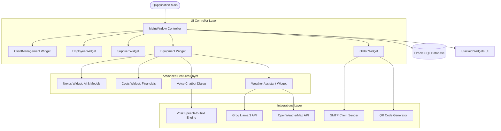

# Technical Documentation — HammerDown ERP

HammerDown is a premium C++ desktop Enterprise Resource Planning (ERP) application developed using the Qt framework. Designed specifically for custom furniture workshop and fabrication factory management, it integrates advanced user interface design, localized database operations, and external API integrations.

---

## 1. Project Architecture

The application adopts a clean, modular structure leveraging the **Qt Event-Driven Signal-and-Slot paradigm**:



### Key Modules:
*   **Controller Layer (`MainWindow`)**: Orchestrates the modules, bootstraps the DB connections, manages dynamic layouts, and coordinates global menus.
*   **Module Logic (`*.cpp` / `*.h`)**: Encapsulates specific logic for clients, employees, suppliers, equipment, and order processing.
*   **View Layer (`*.ui`)**: XML definitions compiled by Qt User Interface Compiler (`uic`) into native C++ headers.
*   **Static Assets & Resources (`.qrc`)**: Embedded graphics, sounds, and translation binaries loaded at runtime via the Qt virtual file system (`:/`).

---

## 2. Database Design & Entity-Relationship

The system connects to an **Oracle SQL Database** using Oracle Call Interface (`QOCI`) or ODBC fallback. It consists of 6 primary relational tables:

```
  +-------------------+              +-------------------+
  |     EMPLOYEES     |              |      CLIENTS      |
  +-------------------+              +-------------------+
  | * EMPLOYEE_ID     |              | * CLIENT_ID       |
  |   FIRST_NAME      |              |   FIRST_NAME      |
  |   LAST_NAME       |              |   LAST_NAME       |
  |   JOB_TITLE       |              |   EMAIL           |
  |   EMAIL           |              |   PHONE_NUMBER    |
  |   PHONE_NUMBER    |              |   ADDRESS         |
  |   SALARY          |              |   GENDER          |
  |   HIRE_DATE       |              |   ACCOUNT_BALANCE |
  +---------+---------+              +---------+---------+
            |                                  |
            | 1                                | 1
            |                                  |
            | 0..*                             | 0..*
  +---------v---------+              +---------v---------+
  |     EQUIPMENT     |              |      ORDERS       |
  +-------------------+              +-------------------+
  | * EQUIPMENT_ID    |              | * ORDER_ID        |
  |   EQUIPMENT_TYPE  |              |   CLIENT_ID (FK)  |
  |   QUANTITY        |              |   EMPLOYEE_ID(FK) |
  |   UNIT_PRICE      |              |   ORDER_TYPE      |
  |   STATUS          |              |   TOTAL_PRICE     |
  |   EMPLOYEE_ID(FK) |              |   ORDER_DATE      |
  +---------+---------+              +-------------------+
            |
            | (Generates audit logs via DB trigger)
            v
  +-------------------+              +-------------------+
  | EQUIPMENT_HISTORY |              |     SUPPLIERS     |
  +-------------------+              +-------------------+
  | * HISTORY_ID      |              | * SUPPLIER_ID     |
  |   EQUIPMENT_ID    |              |   SUPPLIER_NAME   |
  |   OPERATION_TYPE  |              |   DELIVERY_RATING |
  |   CHANGE_DATE     |              |   QUALITY_RATING  |
  |   CHANGED_BY      |              |   ACCOUNT_STATUS  |
  +-------------------+              +-------------------+
```

### Database Security & Configuration
Database credentials and endpoints are loaded dynamically from environment variables, preventing raw credentials from leaking:
*   `DB_HOST` (Default: `localhost`)
*   `DB_PORT` (Default: `1521`)
*   `DB_NAME` (Default: `source_2a4`)
*   `DB_USER` (Default: `SYSTEM`)
*   `DB_PASS` (Default: `esprit1`)

---

## 3. High-Value Subsystems

### 3.1 Vosk Voice Command Recognition
The system provides a hands-free **Voice Chatbot Assistant** using the offline Vosk engine:
*   **Vosk API**: Local execution, removing internet latency and dependencies.
*   **VoiceCommandEngine**: Spawns an asynchronous listening thread recording microphone inputs, feeding audio samples to the neural network acoustic model, and mapping transcribed words to database query actions (e.g., "show clients", "add employee").

### 3.2 Dynamic Weather Analysis & Groq LLM Recommendations
The **WeatherAssistant** widget helps carpentry workshops adapt to atmospheric conditions:
*   **OpenWeatherMap API**: Fetches current weather telemetry (temperature, humidity, pressure) for Tunis.
*   **Groq API (Llama 3)**: Performs contextual analysis based on weather parameters to supply actionable advice. High humidity prompts advice about lumber moisture acclimatization; high heat warns of rapid glue curing.

### 3.3 SMTP Mailing Engine & QR Code Generator
*   **SMTP Dispatcher**: Employs non-blocking TCP socket communication with secure SSL/TLS handshakes to email purchase summaries, alert suppliers, and dispatch invoices.
*   **QR Code Generator**: Encodes order parameters and equipment identifiers into high-density 2D barcodes, enabling instant scanning by mobile client devices.

### 3.4 Dynamic Internationalization (i18n)
Full localization capability via **Qt Linguist**:
*   `app_fr.ts` (XML source translation) compiled into `app_fr.qm` (compact binary format).
*   Dynamic runtime swapping lets users switch between English and French without requiring application restarts.
